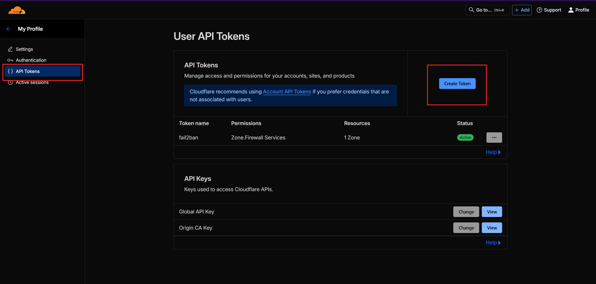
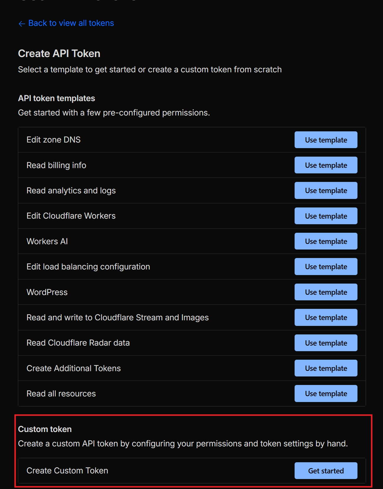
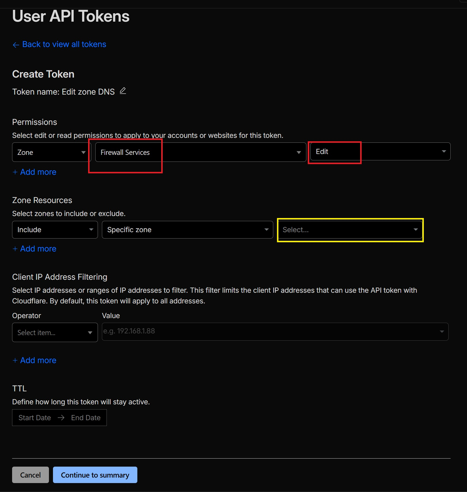
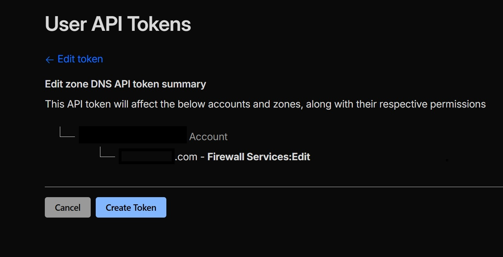

To craete an API key, follow these steps:
1. Log in to your Cloudflare account.
2. Navigate to the "My Profile" section.

3. Click on the "API Tokens" tab and Click on "Create Token".

4. Select "Create Custom Token".

5. Configure the token with the following permissions:
- Under "Permissions", add the following `Zone:Firewall Services: Edit`
- Under "Zone Resources", select: Include:Specific zones: and choose your domain.

6. Click "Continue to summary", review the settings, and then click "Create Token

7. Copy the generated API token and store it securely. You will need this token to configure your Cloudflare Tunnel with Traefik.