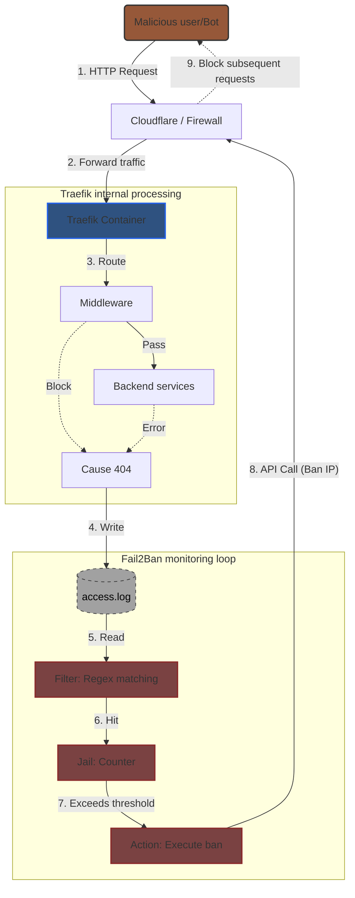

# Home Server Setup with Docker, Traefik, Cloudflare Tunnel, and Fail2Ban
<b>
Offers a concise guide and ready-to-use configs to securely run a home server with Docker, Traefik (reverse proxy), Cloudflare Tunnel (private access), and Fail2Ban (security)—all without exposing your homelab or public IP.
</b>
<br><br>
The docker-compose.yml file includes configurations for 
- Traefik
- Cloudflare Tunnel

and optional services like 
- Jellyfin
- Homepage
- GitLab
- Vaultwarden
- Nextcloud
- Trilium
- WUD

You can enable or disable these services by commenting or uncommenting the relevant sections in the `docker-compose.yml` file.
<br><br>
## 🚀 Architecture Overview
The following diagram illustrates the interaction between components in this setup, focusing on how Fail2Ban integrates with Traefik and Cloudflare to enhance security by banning malicious IPs based on access logs.



## 📋 Prerequisites
Cloudflare API Token & Zone ID
    - Create a Cloudflare API Token with permissions to manage Firewall and Access rules.
    - Obtain your Zone ID from the Cloudflare dashboard for your domain.
## 🖥️ Hardware Requirements
| Subject  | Minimum requirement | Suggetsion |
| --- | ----------------- | ----------- |
| CPU | 1 Core            | 2 Cores     | 
| RAM | 512 MB            | 1 GB - 2 GB | 
| Disk | 5 GB             | 10 GB       | 

<br>

If you want to deploy gitlab, you may need higher specs:
| Subject   | Minimum requirement | Suggetsion  |
| ---- | ----------- | --------------- |
| CPU  | 2 Cores     | 4 Cores (or more)   | 
| RAM  | 4 GB        | 8 GB - 16 GB    |
| Disk   | 20 GB       | 50 GB SSD (or more) | 
| Swap | 2 GB        | 4 GB            | 

## 💾 Software Requirements
1. Docker Engine: Container runtime.

2. Docker Compose (V2): Used to manage multi-container applications (now usually included in the docker-compose-plugin; the command is docker compose instead of docker-compose).

3. Fail2Ban: Install on the host machine (do not install inside Docker unless you are an advanced user), as it needs to operate the host's firewall or call APIs.
  Installation command: `sudo apt update && sudo apt install fail2ban -y`

4. Curl / Wget: Used to test connectivity.

## 🌐 Network & Domain
1. Domain Name: Required for Traefik routing and Cloudflare Tunnel.

2. Cloudflare Account: Free plan is sufficient.

3. Cloudflare Tunnel: Create a Tunnel in the Cloudflare Zero Trust Dashboard and obtain the Tunnel Token.

4. DNS Records: Point your domain or subdomain to Cloudflare's nameservers

## ✅ Configuration Checklist
### Project Structure
Organize your project directory as follows:
```
/home/user/homelab/
├── docker-compose.yml
├── .env                  # stores Token and passwords
└── traefik/
    ├── data/
    │   ├── traefik.yml   # static configuration
    │   └── config.yml    # dynamic configuration (Middleware defined here)
    └── logs/             # stores access.log (for Fail2Ban to read)
```
The filters and actions for Fail2Ban are located in the server's filter.d/ and action.d/ directories respectively. Ensure these files are correctly placed in your Fail2Ban configuration directory.
```
/etc/fail2ban/
├── action.d/
│   └── cloudflare.conf           # Cloudflare API action
├── filter.d/
│   ├── traefik-auth.conf         # Traefik Auth Fail2Ban filter
│   ├── traefik-ratelimit.conf    # Traefik rate limit Fail2Ban filter
│   └── traefik-botsearch.conf    # Traefik Bot Search Fail2Ban filter
└── jail.d/
    └── traefik.conf              # Traefik Jail configuration

```

## FAQ & Troubleshooting

1. Create cloudflare API key can refer to [Create API key](Guides/Create_APIkey.md)

2. Common Issues & Fixes can be found in [Troubleshooting](Guides/Troubleshooting.md)

3. How to generate htpasswd for trilium?
    If you have apache in your system, you can generate an htpasswd entry using the following command:
    ```
    htpasswd -nbB <username> <password>
    ```
    Or, you can use an online htpasswd generator like [htpasswd generator](https://www.htaccesstools.com/htpasswd-generator/).
    Replace `<username>` and `<password>` with your desired credentials. The output will be in the format `username:hashed_password`, which you can directly use in the Traefik labels for basic authentication.

4. Zone ID can be easily found in the Cloudflare dashboard: go to your domain, select `Overview`, then scroll down to the bottom right section labeled `API`—your Zone ID will be displayed there.

5. The banned IP can be found in cloudflare dashboard under your domain -> Security -> Security rules -> Managed rules.

