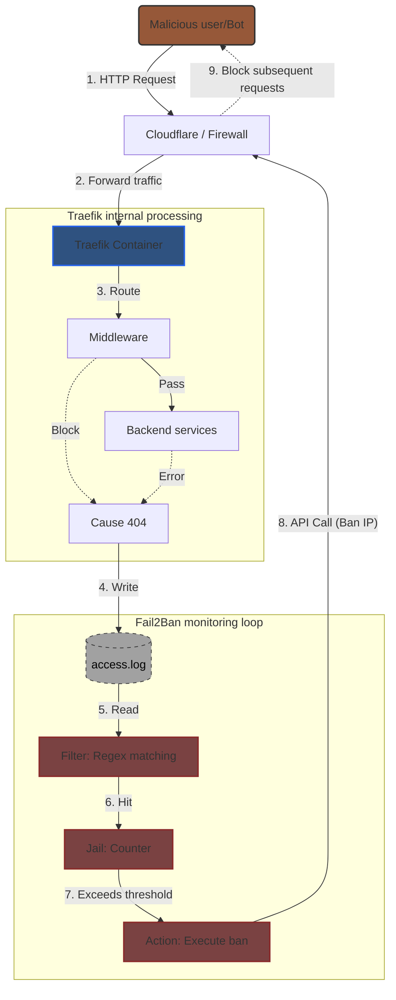
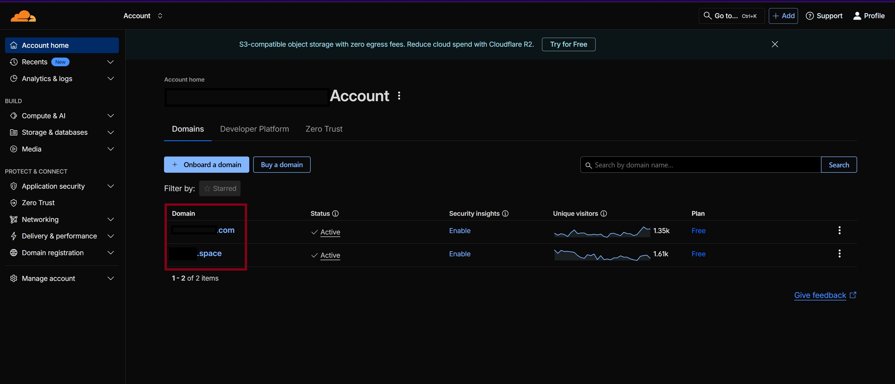
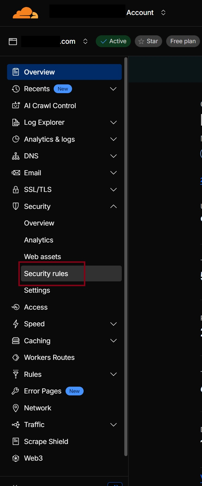

# Home Server Setup with Docker, Traefik, Cloudflare Tunnel, and Fail2Ban

A production-ready, secure homelab stack that provides a complete reverse proxy solution with private access and automated security protection. This setup allows you to run multiple self-hosted services without exposing your homelab's public IP address.

## 🎯 Key Features

- **Zero Public IP Exposure**: Cloudflare Tunnel provides secure, private access without opening ports on your router
- **Automated Security**: Fail2Ban monitors access logs and automatically bans malicious IPs via Cloudflare API
- **Reverse Proxy**: Traefik handles routing, SSL termination (at edge), rate limiting, and security headers
- **Docker-Based**: All services run in containers for easy management and isolation
- **Ready-to-Use Configs**: Pre-configured templates for popular self-hosted applications

## 📦 Included Services

### Core Services (Always Enabled)
- **Traefik**: Reverse proxy and load balancer with automatic service discovery
- **Cloudflare Tunnel (cloudflared)**: Secure tunnel to Cloudflare edge network

### Optional Services (Commented by Default)
The `docker-compose.yml` file includes pre-configured templates for:
- **Jellyfin**: Media server for organizing and streaming your media collection
- **Homepage**: Modern dashboard for your homelab services
- **GitLab**: Self-hosted Git repository and CI/CD platform
- **Vaultwarden**: Lightweight Bitwarden-compatible password manager
- **Nextcloud**: File sync and sharing platform
- **Trilium**: Personal knowledge management system
- **WUD (What's Up Docker)**: Container update notifier

You can enable any of these services by uncommenting the relevant sections in `docker-compose.yml`.

## 🚀 Architecture Overview
The following diagram illustrates the interaction between components in this setup, focusing on how Fail2Ban integrates with Traefik and Cloudflare to enhance security by banning malicious IPs based on access logs.



## 📋 Prerequisites

### Cloudflare Account Setup

1. **Cloudflare Account**: Free plan is sufficient for this setup
2. **Domain Name**: A domain registered with Cloudflare (or transferred to Cloudflare nameservers)
3. **Cloudflare API Token**: Create a token with the following permissions:
   - Zone: Zone Settings: Read
   - Zone: Zone: Read
   - Account: Cloudflare Tunnel: Edit
   - Zone: Firewall Services: Edit
   - Zone: Zone: Read
   
   Detailed instructions: [Create API Key Guide](Guides/Create_APIkey.md)

4. **Zone ID**: Found in Cloudflare dashboard → Your Domain → Overview → API section (bottom right)

5. **Cloudflare Tunnel Token**: 
   - Navigate to Cloudflare Zero Trust Dashboard
   - Create a new Tunnel
   - Copy the Tunnel Token (starts with a long alphanumeric string)

## 🖥️ Hardware Requirements

### Base Requirements (Traefik + Cloudflare Tunnel Only)
| Component | Minimum | Recommended |
|-----------|---------|-------------|
| CPU | 1 Core | 2 Cores |
| RAM | 512 MB | 1-2 GB |
| Disk | 5 GB | 10 GB |

### With Additional Services
| Component | Minimum | Recommended |
|-----------|---------|-------------|
| CPU | 2 Cores | 4+ Cores |
| RAM | 2 GB | 4-8 GB |
| Disk | 20 GB | 50+ GB SSD |

### GitLab-Specific Requirements
If deploying GitLab, significantly higher resources are needed:
| Component | Minimum | Recommended |
|-----------|---------|-------------|
| CPU | 2 Cores | 4+ Cores |
| RAM | 4 GB | 8-16 GB |
| Disk | 20 GB | 50+ GB SSD |
| Swap | 2 GB | 4 GB | 

## 💾 Software Requirements

### Required Software

1. **Docker Engine** (version 20.10+)
   - Container runtime for running services
   - Installation: Follow [Docker official installation guide](https://docs.docker.com/engine/install/)

2. **Docker Compose V2** (included with Docker Desktop or docker-compose-plugin)
   - Used to manage multi-container applications
   - Command: `docker compose` (note: space, not hyphen)
   - Verify: `docker compose version`

3. **Fail2Ban** (installed on host, not in Docker)
   - Monitors logs and bans malicious IPs via Cloudflare API
   - Installation: `sudo apt update && sudo apt install fail2ban -y`
   - **Important**: Must run on host to access logs and execute API calls

4. **Curl or Wget**
   - For testing connectivity and API calls
   - Usually pre-installed on Linux systems

### Optional Tools
- **htpasswd**: For generating basic auth credentials (Apache utils package)
- **Text Editor**: For editing configuration files (nano, vim, or VS Code)

## 🌐 Network & Domain Configuration

### Domain Setup
1. **Domain Registration**: You need a domain name (can be purchased from any registrar)
2. **Cloudflare Nameservers**: Point your domain to Cloudflare's nameservers
   - Add your domain to Cloudflare
   - Update nameservers at your domain registrar to match Cloudflare's provided nameservers
3. **DNS Records**: Configure public hostnames in Cloudflare Tunnel dashboard
   - Each service needs a public hostname (e.g., `traefik.yourdomain.com`)
   - Set HTTP Host Header to match the domain
   - Point to `http://traefik:80` (internal Docker network)

### Cloudflare Tunnel Setup
1. **Create Tunnel**: 
   - Go to Cloudflare Zero Trust Dashboard → Networks → Tunnels
   - Click "Create a tunnel" → Choose "Cloudflared"
   - Copy the Tunnel Token

2. **Configure Public Hostnames**:
   - For each service, add a public hostname
   - Set the HTTP Host Header to match your domain
   - Set the service URL to `http://traefik:80`

### Network Architecture
```
Internet → Cloudflare Edge → Cloudflare Tunnel → Traefik → Services
         (SSL/TLS)          (HTTP)              (HTTP)    (HTTP)
```
All SSL/TLS termination happens at Cloudflare's edge. Internal communication uses HTTP.

## ✅ Configuration Checklist

### Step 1: Clone or Download This Repository

```bash
git clone <repository-url>
cd secure-homelab-gateway
```

### Step 2: Project Structure Setup

Create the following directory structure (or use the provided structure):

```
secure-homelab-gateway/
├── docker-compose.yml          # Main compose file with all services
├── .env                        # Environment variables (create this)
├── traefik.yml                 # Traefik static configuration
├── config.yml                  # Traefik dynamic configuration (middlewares)
├── action.d/
│   └── cloudflare.conf         # Fail2Ban Cloudflare API action
├── filter.d/
│   ├── traefik-auth.conf       # Authentication failure filter
│   ├── traefik-botsearch.conf  # Bot scanning detection filter
│   └── traefik-ratelimit.conf  # Rate limit violation filter
├── jail.d/
│   └── traefik.conf            # Fail2Ban jail configuration
└── Guides/
    ├── Create_APIkey.md        # Cloudflare API key creation guide
    └── Troubleshooting.md      # Common issues and solutions
```

### Step 3: Create Environment File

Create a `.env` file in the project root with the following variables:

```bash
# Domain Configuration
DOMAIN_NAME=yourdomain.com

# Data Storage Path (adjust to your preference)
DATA_PATH=/home/user/homelab

# Cloudflare Configuration
CF_TUNNEL_TOKEN=your_cloudflare_tunnel_token_here

# Traefik Basic Auth (generate with: htpasswd -nbB username password)
TRAEFIK_BASIC_AUTH=username:$2y$10$hashed_password_here

# Fail2Ban Cloudflare API (configure in /etc/fail2ban/action.d/cloudflare.conf)
# CF_TOKEN=your_cloudflare_api_token
# CF_ZONE_ID=your_zone_id
```

### Step 4: Configure Traefik Files

1. **traefik.yml**: Static configuration (already provided)
   - Configures entrypoints, providers, and logging
   - Sets up Cloudflare IP ranges for trusted proxies
   - Configures JSON access logs for Fail2Ban

2. **config.yml**: Dynamic configuration (already provided)
   - Defines middlewares: `secure-headers`, `rate-limit`, `rate-limit-strict`
   - These can be referenced in Docker labels with `@file` suffix

### Step 5: Setup Traefik Data Directory

Create the directory structure for Traefik:

```bash
mkdir -p ${DATA_PATH}/traefik/{data,logs}
cp traefik.yml ${DATA_PATH}/traefik/data/
cp config.yml ${DATA_PATH}/traefik/data/
```

### Step 6: Install and Configure Fail2Ban

1. **Install Fail2Ban**:
```bash
sudo apt update && sudo apt install fail2ban -y
```

2. **Copy Configuration Files**:
```bash
# Copy action
sudo cp action.d/cloudflare.conf /etc/fail2ban/action.d/

# Copy filters
sudo cp filter.d/traefik-auth.conf /etc/fail2ban/filter.d/
sudo cp filter.d/traefik-botsearch.conf /etc/fail2ban/filter.d/
sudo cp filter.d/traefik-ratelimit.conf /etc/fail2ban/filter.d/

# Copy jail configuration
sudo cp jail.d/traefik.conf /etc/fail2ban/jail.d/
```

3. **Configure Cloudflare API in Action**:
Edit `/etc/fail2ban/action.d/cloudflare.conf`:
```ini
[Init]
cftoken = your_cloudflare_api_token_here
cfzoneid = your_zone_id_here
```

4. **Update Jail Log Paths**:
Edit `/etc/fail2ban/jail.d/traefik.conf` and update `logpath` to match your Traefik log location:
```ini
logpath = ${DATA_PATH}/traefik/logs/access.log
```

5. **Restart Fail2Ban**:
```bash
sudo systemctl restart fail2ban
sudo systemctl enable fail2ban
```

### Step 7: Start Services

```bash
# Start core services (Traefik + Cloudflare Tunnel)
docker compose up -d

# Verify services are running
docker compose ps

# Check Traefik logs
docker logs traefik

# Check Cloudflare Tunnel logs
docker logs cloudflared
```

### Step 8: Enable Optional Services

1. Edit `docker-compose.yml`
2. Uncomment the service you want to enable
3. Update any service-specific configuration (ports, volumes, etc.)
4. Restart: `docker compose up -d`

## 🔧 Configuration Details

### Traefik Configuration Files

#### traefik.yml (Static Configuration)
- **Entrypoints**: HTTP (port 80) and HTTPS (port 443) - HTTPS is reserved but not used behind Tunnel
- **Providers**: 
  - Docker provider for automatic service discovery
  - File provider for middleware definitions
- **Logging**: JSON format access logs for Fail2Ban parsing
- **Trusted Proxies**: Cloudflare IP ranges configured for real IP propagation

#### config.yml (Dynamic Configuration)
Defines reusable middlewares:
- **secure-headers**: Security headers (X-Frame-Options, HSTS, CSP, etc.)
- **rate-limit**: Standard rate limiting (100 req/s average, 20 burst)
- **rate-limit-strict**: Strict rate limiting (20 req/s average, 5 burst)
- **api-ratelimit**: API-specific rate limiting by host
- **api-auth**: Request header management for APIs

### Fail2Ban Configuration

#### Filters
- **traefik-auth.conf**: Detects 401/403 authentication failures
- **traefik-botsearch.conf**: Detects bot scanning patterns (404s on known malicious paths)
- **traefik-ratelimit.conf**: Detects 429 rate limit violations

#### Jails
- **traefik-auth**: 5 failures in 5 minutes → 10 hour ban
- **traefik-botsearch**: 3 failures in 30 minutes → 7 day ban
- **traefik-ratelimit**: 10 failures in 5 minutes → 2 hour ban

#### Action
- **cloudflare.conf**: Bans IPs via Cloudflare Firewall API
- Automatically creates firewall rules in Cloudflare dashboard

### Service Configuration Examples

Each service in `docker-compose.yml` follows this pattern:
```yaml
labels:
  - "traefik.enable=true"                                    # Enable Traefik routing
  - "traefik.http.routers.service-name.entrypoints=http"     # Use HTTP entrypoint
  - "traefik.http.routers.service-name.rule=Host(`subdomain.domain.com`)"  # Domain routing
  - "traefik.http.routers.service-name.middlewares=middleware-chain"      # Apply middlewares
  - "traefik.http.services.service-name.loadbalancer.server.port=8080"   # Backend port
```

## 📚 FAQ & Troubleshooting

### Quick Reference

1. **Cloudflare API Key Creation**: Detailed guide available in [Create API Key](Guides/Create_APIkey.md)

2. **Common Issues**: Comprehensive troubleshooting guide in [Troubleshooting](Guides/Troubleshooting.md)

3. **Generate htpasswd for Basic Auth**:
   ```bash
   # If you have Apache utils installed
   htpasswd -nbB username password
   
   # Or use online generator
   # https://www.htaccesstools.com/htpasswd-generator/
   ```
   Output format: `username:$2y$10$hashed_password`
   Use this value in `.env` as `TRAEFIK_BASIC_AUTH`

4. **Find Zone ID**: 
   - Cloudflare Dashboard → Your Domain → Overview
   - Scroll to bottom right → API section
   - Zone ID is displayed there

5. **View Banned IPs**:
   - Cloudflare Dashboard → Your Domain → Security → WAF
   - Or: Security → Tools → IP Access Rules
   - Look for rules with "Fail2Ban" in the notes

### Common Commands

```bash
# Check service status
docker compose ps

# View Traefik logs
docker logs traefik -f

# View Cloudflare Tunnel logs
docker logs cloudflared -f

# Check Fail2Ban status
sudo fail2ban-client status
sudo fail2ban-client status traefik-auth

# Test Fail2Ban filter
sudo fail2ban-regex /path/to/traefik/logs/access.log /etc/fail2ban/filter.d/traefik-auth.conf

# Manually ban/unban an IP
sudo fail2ban-client set traefik-auth banip <IP_ADDRESS>
sudo fail2ban-client set traefik-auth unbanip <IP_ADDRESS>

# Restart services
docker compose restart

# Update and restart a specific service
docker compose pull <service-name>
docker compose up -d <service-name>
```

### Verification Checklist

- [ ] Docker and Docker Compose installed and working
- [ ] Fail2Ban installed and running (`sudo systemctl status fail2ban`)
- [ ] `.env` file created with all required variables
- [ ] Traefik data directory created and files copied
- [ ] Fail2Ban configuration files copied to `/etc/fail2ban/`
- [ ] Cloudflare API token configured in `cloudflare.conf`
- [ ] Cloudflare Tunnel token set in `.env`
- [ ] Public hostnames configured in Cloudflare Tunnel dashboard
- [ ] Services accessible via configured domains
- [ ] Traefik dashboard accessible with basic auth
- [ ] Fail2Ban jails active and monitoring logs

## 🖼️ Screenshots

### Finding Banned IPs in Cloudflare Dashboard





## 📖 Additional Resources

- [Traefik Documentation](https://doc.traefik.io/traefik/)
- [Cloudflare Tunnel Documentation](https://developers.cloudflare.com/cloudflare-one/connections/connect-apps/)
- [Fail2Ban Documentation](https://www.fail2ban.org/wiki/index.php/Main_Page)
- [Docker Compose Documentation](https://docs.docker.com/compose/)

## 🤝 Contributing

If you encounter issues not covered in the troubleshooting guide, please:
1. Check existing issues and documentation
2. Document the issue following the troubleshooting guide format
3. Consider contributing improvements

## 📝 License

This project provides configuration templates and guides. Individual services (Traefik, Cloudflare, etc.) have their own licenses.